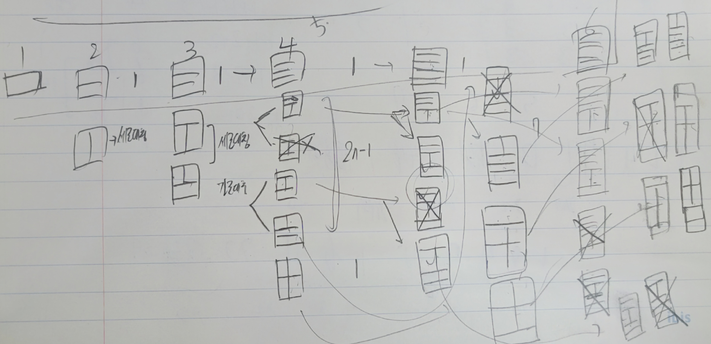
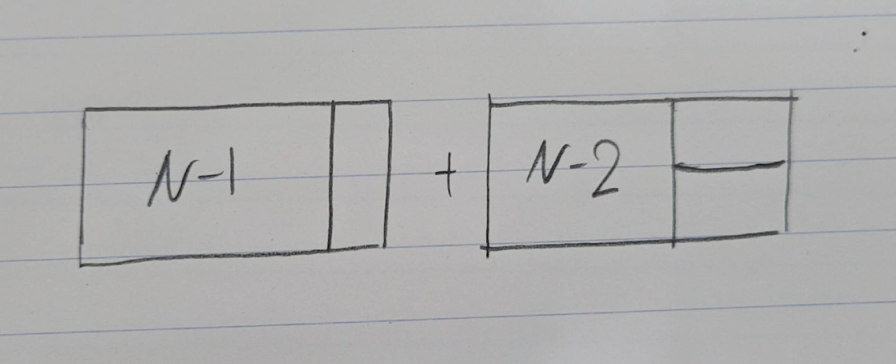

# [Silver III] 2×n 타일링 - 11726 

[문제 링크](https://www.acmicpc.net/problem/11726) 

<b>문제 요약</b>

### 성능 요약

메모리: 31252 KB, 시간: 40 ms

### 분류

다이나믹 프로그래밍

### 제출 일자

2023년 11월 7일 15:58:05

### 문제 설명

2×n 크기의 직사각형을 1×2, 2×1 타일로 채우는 방법의 수를 구하는 프로그램을 작성하시오.

아래 그림은 2×5 크기의 직사각형을 채운 한 가지 방법의 예이다.

### 입력 

 
첫째 줄에 n이 주어진다. (1 ≤ n ≤ 1,000)

### 출력 

 
첫째 줄에 2×n 크기의 직사각형을 채우는 방법의 수를 10,007로 나눈 나머지를 출력한다.

 

## 풀이

문제 보고 냅다 그리기 시작했다. <9095. 1, 2, 3 더하기 문제> 처럼 앞, 뒤만의 관계를 구하려고 했다. 어디서 중복이 생기는지, 몇 개나 중복되는지 등을 생각헸다. 위에서 X표시 한 것들이 중복된 모양들이다.

하지만 이것도 한참 해도 관계를 모르겠었다. 그래서 결국 구글에 사람들이 푼 것들을 찾아봤고 답이 참 쉬웠다.

N개의 직사각형을 채우는 방법은 사진에서처럼 1개의 벽돌을 미리 고정시키고 N-1개의 직사각형을 채우는 방법 수에다가 2개의 벽돌을 세로로 고정시키고 N-2개의 직사각형을 채우는 방법 수를 더하면 된다. 나머지 방법들은 모두 중복되므로 더 이상 더할 필요가 없다.

<b>t(n) = t(n-1) + t(n-2)</b>

 

모양들을 어떻게 저렇게 단순화를 잘 시킬 수 있는지 푼 사람들이 참 신기했다. 문제를 풀 때 앞, 뒤의 모양, 숫자뿐만 아니라 전체적인 모양과 숫자를 보돋록 노력해야 겠다.
