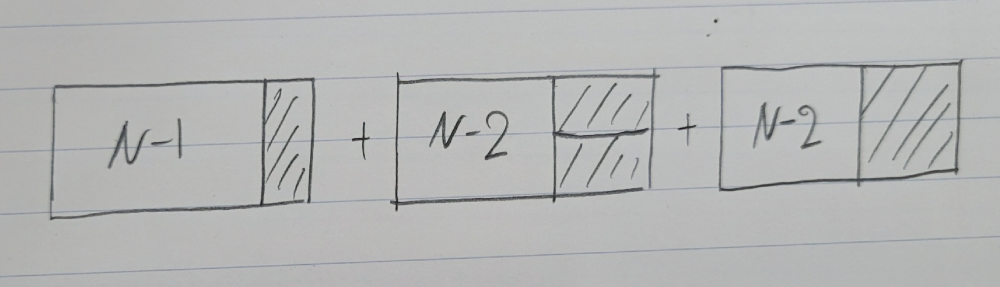

# [Silver III] 2×n 타일링 2 - 11727 

<b>문제 요약</b>

[문제 링크](https://www.acmicpc.net/problem/11727) 

### 성능 요약

메모리: 31120 KB, 시간: 44 ms

### 분류

다이나믹 프로그래밍

### 제출 일자

2023년 11월 7일 16:01:47

### 문제 설명

2×n 직사각형을 1×2, 2×1과 2×2 타일로 채우는 방법의 수를 구하는 프로그램을 작성하시오.

아래 그림은 2×17 직사각형을 채운 한가지 예이다.

### 입력 

 
첫째 줄에 n이 주어진다. (1 ≤ n ≤ 1,000)

### 출력 

 
첫째 줄에 2×n 크기의 직사각형을 채우는 방법의 수를 10,007로 나눈 나머지를 출력한다.

## 풀이

앞의 문제(11726. 2xn 타일링)를 풀고나니 이 문제는 쉬웠다. 이 문제에서는 앞의 문제에서 2x2 타일만 추가된 것이므로 아래 그림과 같이 11726. 2xn 타일링의 답에다가 끝에 2x2 타일을 고정시키고 N-2타일 개수를 추가해주면 되었다.

<b>t(n) = t(n-1) + 2t(n-2)</b>

 

