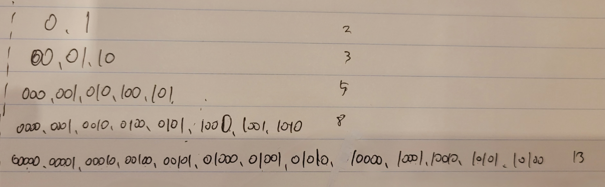
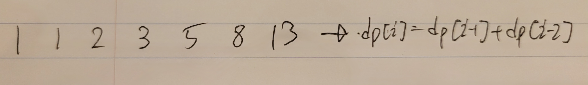

# [Silver III] 이친수 - 2193 

[문제 링크](https://www.acmicpc.net/problem/2193) 

<b>문제 요약</b>

### 성능 요약

메모리: 31120 KB, 시간: 44 ms

### 분류

다이나믹 프로그래밍

### 제출 일자

2023년 11월 9일 13:26:15

### 문제 설명

0과 1로만 이루어진 수를 이진수라 한다. 이러한 이진수 중 특별한 성질을 갖는 것들이 있는데, 이들을 이친수(pinary number)라 한다. 이친수는 다음의 성질을 만족한다.

<ol>
	<li>이친수는 0으로 시작하지 않는다.</li>
	<li>이친수에서는 1이 두 번 연속으로 나타나지 않는다. 즉, 11을 부분 문자열로 갖지 않는다.</li>
</ol>

예를 들면 1, 10, 100, 101, 1000, 1001 등이 이친수가 된다. 하지만 0010101이나 101101은 각각 1, 2번 규칙에 위배되므로 이친수가 아니다.

N(1 ≤ N ≤ 90)이 주어졌을 때, N자리 이친수의 개수를 구하는 프로그램을 작성하시오.

### 입력 

 
첫째 줄에 N이 주어진다.

### 출력 

 
첫째 줄에 N자리 이친수의 개수를 출력한다.

## 해결

일단 규칙을 찾으려고 펜부터 들고 써내려 갔다. 다행이 5번째까지 써내려가니 익숙한 규칙이 보였다.

 

## 23.11.16

더하기 1,2,3 문제를 다른 풀이로 풀고나서 이 문제도 위와는 다른 방식으로 접근할 수 있었다.

|1|2|3|4|5|6|7|8|
|:---:|:---:|:---:|:---:|:---:|:---:|:---:|:---:|
|1|10|10+[2자리의 이친수를 만드는 방법]|1+[3을 만드는 방법]|1+[4를 만드는 방법]|1+[5을 만드는 방법]|1+[6을 만드는 방법]|1+[7을 만드는 방법]|
|||1+2|2+[2을 만드는 방법]|2+[3을 만드는 방법]|2+[4을 만드는 방법]|2+[5을 만드는 방법]|2+[6을 만드는 방법]|
|||2+1|3+[1을 만드는 방법]|3+[2을 만드는 방법]|3+[3을 만드는 방법]|3+[4을 만드는 방법]|3+[5을 만드는 방법]|
|||||||||

### 풀이

<b>dp[i] = dp[i-1]+dp[i-2]<b>
